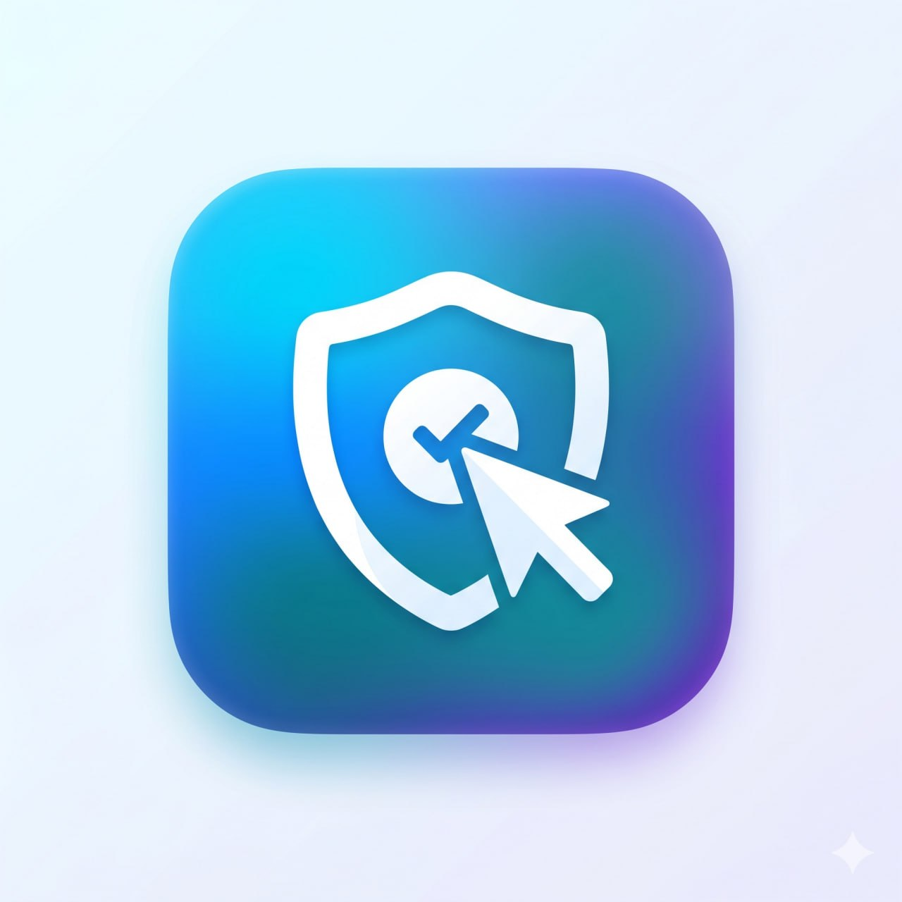

# 🛡️ ClickSafe — Phishing & Malicious URL Detector

<p align="center">
  
</p>

<p align="center">
  
  
  
  
  
  
  
</p>

ClickSafe is a mobile application that detects phishing and malicious URLs using a **dual-layer approach**: a deterministic heuristic rule engine and a Random Forest machine learning model. The Flutter frontend provides instant on-device analysis, while the Python/Flask backend runs full ML inference and optionally checks URLs against Google Safe Browsing in real time.

---

## ✨ Features

- 🔍 **Fast Path** — On-device lexical analysis returns a result in under 1ms before the backend even responds
- 🤖 **ML Detection** — 19-feature Random Forest model trained on 117,604 URLs with 99.74% accuracy
- 📋 **13 Heuristic Rules** — IP hosts, homograph attacks, brand impersonation, free hosting subdomains, phishing keywords, and more
- 🌐 **Google Safe Browsing** — Optional real-time blocklist lookup against confirmed phishing/malware URLs
- ✅ **Tranco Whitelist** — 1,000,000 globally trusted domains skip ML entirely for zero false positives
- 🔬 **Deep Path** — Selenium-powered redirect tracing, WHOIS lookup, and Browser-in-the-Browser (BiTB) detection
- 🧠 **Explainable AI (XAI)** — Visual feature contribution breakdown showing what drove each verdict
- 📷 **QR Code Scanning** — Scan QR codes directly from the camera
- 🕐 **Scan History** — Local history with Safe/Suspicious/Phishing statistics
- 🔄 **Intel Loop** — Submit confirmed phishing URLs to retrain the model incrementally
- ⚙️ **Dynamic Settings** — Configure backend URL and Intel API key at runtime via the Settings screen

---

## 📸 Screenshots

> _Add your screenshots here after building the app._

| Home Screen | Scan Result | XAI Breakdown | Settings |
|---|---|---|---|
| _(screenshot)_ | _(screenshot)_ | _(screenshot)_ | _(screenshot)_ |

---

## 🏗️ Project Structure

```
IsThisSafe/
├── backend/                          # Python/Flask API
│   ├── app.py                        # Routes & entry point
│   ├── train_model.py                # Retrain Random Forest (19 features)
│   ├── requirements.txt              # Python dependencies
│   ├── .env.example                  # Environment variable template
│   ├── models/
│   │   └── model.pkl                 # Pre-trained Random Forest model
│   ├── data/
│   │   ├── tranco.csv                # Tranco top-1M domain whitelist
│   │   └── training_data.csv         # 117,604-URL training dataset
│   └── modules/
│       ├── analyzer.py               # Main orchestrator (hybrid pipeline)
│       ├── rule_engine.py            # 13 deterministic heuristic rules
│       ├── ml_engine.py              # Feature extraction + RF prediction
│       ├── blocklist_checker.py      # Google Safe Browsing v4 wrapper
│       ├── tranco_checker.py         # Whitelist O(1) lookup
│       ├── homoglyph_detector.py     # Unicode look-alike detection
│       ├── deep_analyzer.py          # Selenium + WHOIS deep path
│       ├── intel_loop.py             # Incremental model retraining
│       └── validator.py              # URL validation & normalisation
│
└── flutter_app/                      # Flutter mobile app
    ├── lib/
    │   ├── main.dart                 # Entry point + lifecycle observer
    │   ├── config/app_config.dart    # Thresholds & endpoint builders
    │   ├── models/
    │   │   ├── scan_result.dart      # Full scan result data model
    │   │   └── scan_history_item.dart
    │   ├── screens/
    │   │   ├── home_screen.dart      # URL input, QR scan, scan flow
    │   │   ├── result_screen.dart    # Verdict, XAI, rules, deep path
    │   │   ├── history_screen.dart   # Scan history with stats
    │   │   └── settings_screen.dart  # Backend URL, API key, Intel Loop
    │   ├── services/
    │   │   ├── api_service.dart      # HTTP client (singleton)
    │   │   ├── settings_service.dart # SharedPreferences wrapper
    │   │   ├── fast_path_analyzer.dart # On-device 13-rule engine
    │   │   └── history_service.dart
    │   └── widgets/
    │       ├── verdict_badge.dart
    │       ├── xai_breakdown_widget.dart
    │       └── rule_card_widget.dart
    └── android/app/src/main/
        ├── AndroidManifest.xml               # INTERNET + CAMERA permissions
        └── res/xml/network_security_config.xml
```

---

## 🚀 Quick Start

### Prerequisites

| Tool | Version | Purpose |
|---|---|---|
| Flutter SDK | ≥ 3.3.0 | Mobile app build & run |
| Android Studio | Latest | Android SDK + AVD emulator |
| Java (JDK) | 17.x | Gradle build requirement |
| Python | ≥ 3.10 | Flask backend |

```bash
# Verify prerequisites
flutter --version        # must be >= 3.3.0
java -version            # must be 17.x
python3 --version        # must be >= 3.10

# Accept Android SDK licences (one time only)
flutter doctor --android-licenses
```

---

### Step 1 — Start the Backend

```bash
cd IsThisSafe/backend

# Install dependencies
pip install -r requirements.txt

# Configure environment
cp .env.example .env
# Open .env and set INTEL_API_KEY (required)
# Optionally set GOOGLE_SAFE_BROWSING_KEY for real-time blocklist

# Start Flask (model.pkl is pre-trained and included)
python app.py
# Listening on http://0.0.0.0:5000

# Verify
curl http://localhost:5000/health
# {"status":"ok","tranco_domains":1000000,"model_loaded":true,...}
```

To retrain the model (e.g. after adding more training data):

```bash
python train_model.py
# Trains on data/training_data.csv
# Saves new model.pkl to models/
```

---

### Step 2 — Configure the App

Open the app → tap **⚙ Settings** → **Connection Settings** → enter your backend URL:

| Where you are running | URL to enter |
|---|---|
| Android emulator + local backend | `http://10.0.2.2:5000` |
| Real device on same Wi-Fi | `http://192.168.x.x:5000` |
| Cloud deployment | `https://your-app.onrender.com` |

> ⚠️ Do **not** use `localhost` from the Android emulator — use `10.0.2.2` instead.

Tap **Save & Test** to verify the connection.

---

### Step 3 — Run on Emulator or Device

```bash
cd IsThisSafe/flutter_app

flutter pub get
flutter run                      # debug mode with hot reload
flutter run -d emulator-5554     # specific device
```

---

### Step 4 — Build the APK

```bash
cd IsThisSafe/flutter_app

# Universal APK
flutter build apk --release

# Recommended: split APK (smaller, per CPU architecture)
flutter build apk --split-per-abi --release
# app-arm64-v8a-release.apk   ← modern 64-bit phones
# app-armeabi-v7a-release.apk ← older phones
# app-x86_64-release.apk      ← emulators

# Install via ADB
adb install build/app/outputs/flutter-apk/app-release.apk
```

---

## 🧠 How Detection Works

### Analysis Pipeline

```
URL submitted
     │
     ▼
[1] Validate & Normalise
     │
     ▼
[2] Tranco Whitelist ─── hit ──────────────────────────► ✅ Safe
     │
     ▼
[3] Google Safe Browsing ─── confirmed threat ─────────► 🚨 Phishing
     │
     ▼
[4] Extract 19 ML Features
     │
     ▼
[5] Homoglyph + Link Masking Checks
     │
     ▼
[6] 13 Heuristic Rules → risk_score
     │
     ▼
[7] Random Forest → probability
     │
     ▼
[8] Combined Verdict
    risk_score >= 8  OR  prob >= 0.70  ►  🚨 Likely Phishing
    risk_score >= 4  OR  prob >= 0.40  ►  ⚠️  Suspicious
    otherwise                          ►  ✅ Safe
```

### The 13 Heuristic Rules

| Rule | Severity | Points |
|---|---|---|
| Punycode / Homograph Attack (`xn--` prefix) | HIGH | 5 |
| IP Address as Host | HIGH | 3 |
| Excessively Long URL (> 75 chars) | HIGH | 3 |
| Unusually Long URL (> 54 chars) | MEDIUM | 1 |
| Excessive Subdomains (> 3 labels) | HIGH | 3 |
| @ Symbol in URL | HIGH | 3 |
| Double Slash Redirection | HIGH | 3 |
| Multiple Hyphens in Domain | MEDIUM | 1 |
| No HTTPS | MEDIUM | 1 |
| Suspicious TLD (`.tk`, `.xyz`, `.click`, etc.) | HIGH | 3 |
| URL Shortener Detected | MEDIUM | 1 |
| Excessive Percent-Encoding (≥ 3) | MEDIUM | 1 |
| **Brand Name in Path** (impersonation) ★ | HIGH | 3 |
| **Multiple Phishing Keywords** (≥ 2 hits) ★ | MEDIUM | 1 |
| **Free Hosting Subdomain** (Netlify, Vercel…) ★ | HIGH | 3 |

★ New in v2. Long-URL rules are suppressed for Amazon, YouTube, GitHub, LinkedIn, Google Maps, and Twitter/X.

### The 19 ML Features

| Index | Feature | Description |
|---|---|---|
| 0–13 | Core lexical features | URL length, dots, hyphens, entropy, HTTPS, subdomains, etc. |
| **14** | `has_suspicious_tld` | TLD in abused registry (`.tk`, `.xyz`, `.cn`…) ★ |
| **15** | `hostname_digit_ratio` | Fraction of digits — catches machine-generated domains ★ |
| **16** | `vowel_ratio` | Vowel fraction — gibberish domains deviate from natural language ★ |
| **17** | `has_non_standard_port` | Non-standard port (not 80/443/8080/8443) ★ |
| **18** | `http_count_in_url` | Embedded HTTP occurrences — proxy for redirect chains ★ |

★ New in v2.

---

## ⚙️ Environment Variables

```bash
cp backend/.env.example backend/.env
```

| Variable | Required | Default | Description |
|---|---|---|---|
| `PORT` | No | `5000` | TCP port Flask binds to |
| `FLASK_DEBUG` | No | `false` | Never `true` in production |
| `ALLOWED_ORIGINS` | No | `*` | CORS origins — restrict in production |
| `INTEL_API_KEY` | **Yes** | `changeme` | Must match Flutter Settings X-Intel-Key header |
| `GOOGLE_SAFE_BROWSING_KEY` | No | _(empty)_ | Real-time blocklist — 10,000 free req/day |
| `MODEL_PATH` | No | `models/model.pkl` | Path to trained model |
| `TRANCO_PATH` | No | `data/tranco.csv` | Path to Tranco domain list |

```bash
# Generate a strong Intel API key
python -c "import secrets; print(secrets.token_hex(32))"
```

Get a free Safe Browsing key: https://developers.google.com/safe-browsing/v4/get-started

---

## 🔗 API Reference

| Method | Endpoint | Auth | Description |
|---|---|---|---|
| `GET` | `/health` | None | Liveness probe |
| `POST` | `/analyze` | None | Fast Path — `{"url":"...","visible_text":"..."}` |
| `POST` | `/deep-analyze` | None | Deep Path — `{"url":"..."}` — takes 5–30s |
| `GET` | `/feature-importances` | None | XAI: RF feature importance list |
| `POST` | `/intel-loop/ingest` | `X-Intel-Key` | Ingest phishing URLs for retraining |
| `GET` | `/intel-loop/stats` | `X-Intel-Key` | Signature database statistics |

---

## 🧪 Test Cases

| URL | Expected | What Is Verified |
|---|---|---|
| `https://google.com` | ✅ Safe | Tranco whitelist hit |
| `http://paypal-verify.netlify.app/login` | 🚨 Phishing | Free hosting + brand in path |
| `http://secure-login-verify.paypal-account.xyz/confirm/password` | 🚨 Phishing | Suspicious TLD + keywords + brand in path |
| `https://amazon.com/dp/B08N5/ref=sr_1_1?keywords=laptop` | ✅ Safe | Long-URL false-positive suppression |
| `http://192.168.1.1/admin` | ⚠️ Suspicious | IP host + no HTTPS |
| `https://bit.ly/3xAbCdE` | ⚠️ Suspicious | URL shortener → deep path triggered |

---

## 🛠️ Common Build Issues

| Error | Fix |
|---|---|
| `minSdkVersion must be >= 21` | In `build.gradle.kts` set `minSdk = 21` |
| `Cleartext HTTP not permitted` | Use `http://10.0.2.2:5000` not `localhost` in emulator |
| `resource xml/network_security_config not found` | Ensure `res/xml/network_security_config.xml` exists |
| `flutter pub get` fails | Run `flutter upgrade` then retry |
| `FileNotFoundError: model.pkl` | Run `python train_model.py` from `backend/` |
| `ValueError: model expects N features` | Stale model.pkl — run `python train_model.py` to retrain |
| `No connected devices` | Start AVD in Android Studio or enable USB Debugging |

---

## 📦 Key Dependencies

**Backend** — `flask`, `flask-cors`, `scikit-learn`, `joblib`, `numpy`, `requests`, `selenium`, `python-whois`, `gunicorn`

**Flutter** — `http`, `shared_preferences`, `url_launcher`, `mobile_scanner`, `share_plus`, `clipboard`, `cupertino_icons`

---

## 📄 License

This project is licensed under the MIT License.

---

<p align="center">Built with ❤️ using Flutter · Python · Machine Learning</p>
